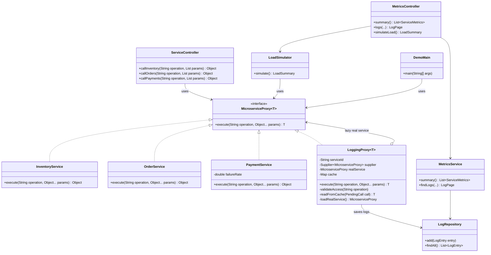

# UML class diagram

```mermaid
classDiagram
    class MicroserviceProxy~T~ {
        <<interface>>
        +execute(String operation, Object... params) T
    }

    class InventoryService {
        +execute(String operation, Object... params) Object
    }

    class OrderService {
        +execute(String operation, Object... params) Object
    }

    class PaymentService {
        -double failureRate
        +execute(String operation, Object... params) Object
    }

    class LoggingProxy~T~ {
        -String serviceId
        -Supplier~MicroserviceProxy~ supplier
        -MicroserviceProxy realService
        -Map cache
        +execute(String operation, Object... params) T
        -validateAccess(String operation)
        -readFromCache(PendingCall call) T
        -loadRealService() MicroserviceProxy
    }

    class LogRepository {
        +add(LogEntry entry)
        +findAll() List~LogEntry~
    }

    class ServiceController {
        +callInventory(String operation, List params) Object
        +callOrders(String operation, List params) Object
        +callPayments(String operation, List params) Object
    }

    class MetricsController {
        +summary() List~ServiceMetrics~
        +logs(...) LogPage
        +simulateLoad() LoadSummary
    }

    class MetricsService {
        +summary() List~ServiceMetrics~
        +findLogs(...) LogPage
    }

    class LoadSimulator {
        +simulate() LoadSummary
    }

    class DemoMain {
        +main(String[] args)
    }

    MicroserviceProxy <|.. InventoryService
    MicroserviceProxy <|.. OrderService
    MicroserviceProxy <|.. PaymentService
    MicroserviceProxy <|.. LoggingProxy
    LoggingProxy o--> MicroserviceProxy : lazy real service
    LoggingProxy --> LogRepository : saves logs
    ServiceController --> MicroserviceProxy : uses
    LoadSimulator --> MicroserviceProxy : uses
    DemoMain --> MicroserviceProxy : uses
    MetricsController --> MetricsService
    MetricsController --> LoadSimulator
    MetricsService --> LogRepository
```
